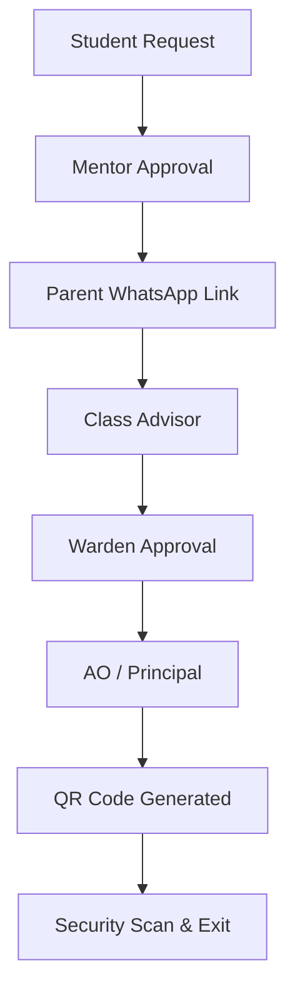
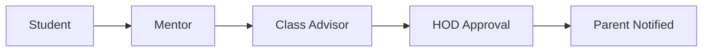

# 🛡️ PermitHub — College Permission Automation System

[](https://spring.io/projects/spring-boot)
[](https://reactjs.org/)
[](https://www.mysql.com/)
[](https://tailwindcss.com/)
[](LICENSE)

PermitHub is a comprehensive, enterprise-grade digital solution designed to automate and streamline student permission workflows in educational institutions. It replaces manual paper-based processes with a secure, hierarchical approval system for Leaves, OD (On-Duty), and Outpasses.

---

## 🚀 Key Features

- **⚡ Hierarchical Approvals**: Intelligent routing through Mentors, Class Advisors, HODs, Wardens, AOs, and Principals.
- **📱 WhatsApp Integration**: Tokenized, non-login approval links for parents via Twilio/Fast2SMS.
- **🛡️ QR Gate Pass**: Real-time QR code generation and scanning for security personnel to track entries/exits.
- **📊 Smart Leave Tracking**: Automated leave balance management per student per semester.
- **📎 Bulk Operations**: Excel-based bulk onboarding for students and faculty data.
- **🔔 Real-time Notifications**: Instant in-app alerts for pending requests and approval status updates.
- **🧪 API Documentation**: Integrated Swagger/OpenAPI UI for easy backend exploration.

---

## 📸 Screenshots

| Dashboard | Outpass Request | QR Scanner |
| :---: | :---: | :---: |
|  |  |  |

---

## 🏗️ System Architecture

### Approval Workflows

#### 1. Outpass Workflow (The most secure)


#### 2. Leave & OD Workflow


---

## 🛠️ Technical Stack

- **Backend**: Java 17, Spring Boot 3.2, Spring Security (JWT), Spring Data JPA, Hibernate, Maven.
- **Frontend**: React 18, Vite, Redux Toolkit, Tailwind CSS, Axios, Lucide Icons.
- **Database**: MySQL 8.0+.
- **Third-Party**: Twilio (WhatsApp/SMS), ZXing (QR Codes), Apache POI (Excel).

---

## ⚙️ Setup & Installation

### 1. Prerequisites
- JDK 17+
- Node.js 18+
- MySQL 8.0+
- Maven 3.8+

### 2. Database Configuration
```sql
CREATE DATABASE smart_permithub;
-- Use the database/schema.sql file to seed initial data
```

### 3. Backend Setup
```bash
cd backend
# Create a .env file with the following keys:
DB_URL=jdbc:mysql://localhost:3306/smart_permithub?createDatabaseIfNotExist=true
DB_USERNAME=root
DB_PASSWORD=your_password
JWT_SECRET=your_super_secret_key
MAIL_USERNAME=your_email
MAIL_PASSWORD=your_app_password

mvn clean install
mvn spring-boot:run
```

### 4. Frontend Setup
```bash
cd frontend
npm install
npm run dev
```

---

## 🐳 Docker Deployment

The project includes Docker support for easy deployment on platforms like Render, Railway, or DigitalOcean.

**Backend (Render/Generic):**
```bash
docker build -t permithub-backend ./backend
```

**Frontend:**
```bash
docker build -t permithub-frontend ./frontend
```

---

## 🔑 Default Accounts

| Role | Email | Password |
| :--- | :--- | :--- |
| **HOD / Admin** | `hod.cse@college.edu` | `Admin@123` |
| **Faculty** | `faculty.priya@college.edu` | `Admin@123` |
| **Student** | `2k22it31@kiot.ac.in` | `Admin@123` |
| **Security** | `security@college.edu` | `Admin@123` |

---

## 📄 License
This project is licensed under the MIT License - see the [LICENSE](LICENSE) file for details.

## 🤝 Contributing
Contributions are welcome! Please open an issue or submit a pull request for any improvements.

---
⭐ **If you find this project helpful, give it a star on GitHub!**
